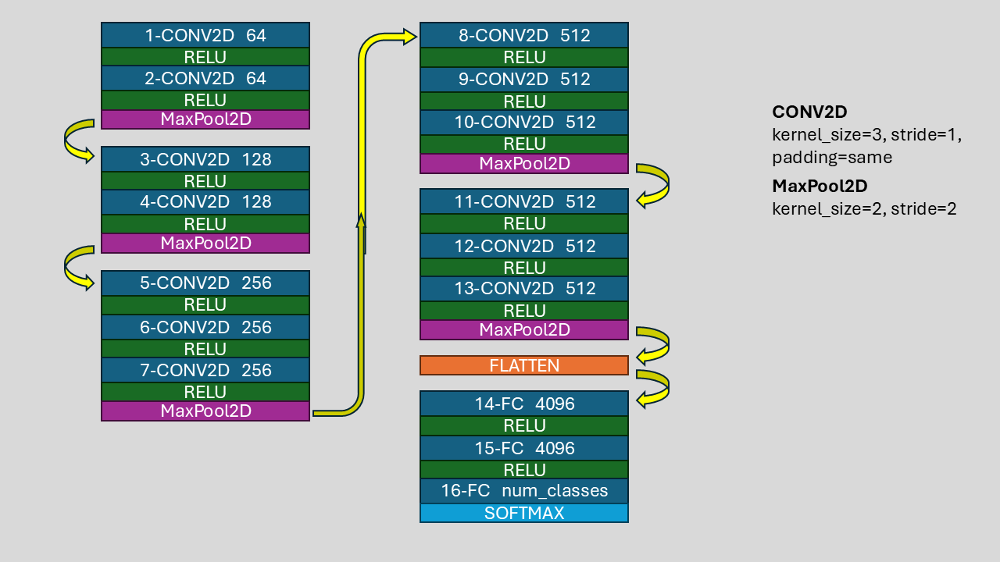
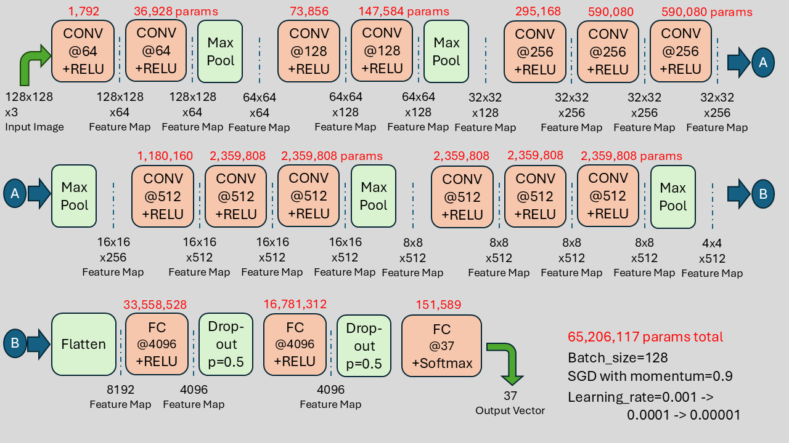

# p011-vgg16-oxfordiiitpet
VGG16 (CNN model) applied on OxfordIIIT Pet Dataset from scratch and through transfer learning; in both tensorflow and pytorch frameworks.
<!-- Finetuning and feature extraction were explored and performance was noted.  Effect of synthetic data (through augmentation techniques) was also observed. -->

# Result
Higher result eas achieved with transfer learning in pytorch implementation of VGG16 $\approx$ 85%. Here only last layer was trained while remaining model was kept froze. Tensorflow VGG transfer model did not have dropout layers and as our data is small so accuracy of $\approx$ 52% was achieved else it overfits. Training from scratch was not only time-consuming but due to small dataset is almost not feasible for large model like vgg16. Results can be seen in below [table](#vgg16-experimentation-summary)

# Dataset and Split
The Oxford-IIIT pet dataset is a 37 category pet image dataset with roughly 200 images for each class. Data has 7349 images of pets and is split into 85:15 train/test data respectively.
# Preprocessing
Images are normalized with dataset mean and std. Moreover, VGG16 was also trained on normalized IMAGENET data. 
# Data Augmentation
Data augmentation plays important part in training model especially when data is limited. Dataset size is increased by 6 fold via augmentation techniques in file [pytorch_utils](pytorch_utils.py). Original images are concatenated with central and corners crop. Central, top left, top right, bottom left, bottom left crops are additionally preprocessed by left_right_flip, random_hue, random_brightness, random_saturation, random_contrast; respectively. Moreover, corner crops are randomly left_right flipped using different seeds.
# VGG16 Architecture
VGG16 has 16 layers with learnable parameters; of which 13 are convolutional layers and 3 are fully connected layers.

Original VGG16 used 224 image size as input but we are using 128; due to which learnable parameters are reduced. Detailed diagram with output_shape after each layer and their parameters is: 

# VGG16 Experimentation Summary

|  file_name.ipynb | train_acc | val_acc | L2_reg | lr | epoch | train_loss | val_loss | Normalization | Synthetic Data | Transfer Learning Technique |
|:-------|:-------:|:-------:|:-------:|:-------:|:-------:|:-------:|:-------:|:-------:|:-------:|:-------:|
| [1_tf_vgg16_scratch](1_tf_vgg16_scratch.ipynb) | 17.25 | 13.08 | 0.005 |  0.0001  |   7   | 126.41 | 126.51 | yes | no  | no dropout between fc layers used |
| [1_torch_vgg16_scratch](1_torch_vgg16_scratch.ipynb) | 10.61 | 10.9 | no | 0.001, 0.0005  | 10,10 | 3.32724 | 3.32627 | yes | no  | dropout between fc layers used |
| [2_tf_mod_vgg16_scratch](2_tf_mod_vgg16_scratch.ipynb) | 25.58 | 19.53 | 0.005 | 0.0001,0.0003,0.0003     | 7,7,7   | 121.3388 | 121.3524 | yes | no | batch-norm and dropout used between conv and fc layers, respectively  |
| [2_torch_mod_vgg16_scratch](2_torch_mod_vgg16_scratch.ipynb) | 16.79 | 17.80 | 0.05 | 0.001,0.0001,0.00001    | 7,7,4   | 3.0517 | 3.0683 | yes | no | batch-norm and dropout used between conv and fc layers, respectively |
| [3_tf_mod_vgg16_scratch_adamw](3_tf_mod_vgg16_scratch_adamw.ipynb) | 24.28 | 22.16 | 0.004 | 0.001          | 20    | 3.0195 | 3.0707 | yes | no | batch-norm and dropout used between conv and fc layers, respectively with adamw optimizer |
| [3_torch_mod_vgg16_scratch_adamw](3_torch_mod_vgg16_scratch_adamw.ipynb) | 35.88 | 31.97 | 0.05 | 0.00005,0.000005,0.0000005,0.00000005       | 4,4,4,3    | 2.5724 | 2.6797 | yes | no | batch-norm and dropout used between conv and fc layers, respectively with adamw optimizer |
| [4_tf_mod_vgg16_scratch_adamw_synthetic](4_tf_mod_vgg16_scratch_adamw_synthetic.ipynb) | 35.88 | 31.97 | 0.1 | 0.0001,0.000005  | 3,3 | 2.2091 | 2.4069 | yes | yes | batch-norm,dropout used with synthetic data |
| [5_tf_vgg16_transfer_learn](5_tf_vgg16_transfer_learn.ipynb) | 53.92 | 52.50 | no | 0.0005, 0.00001,0.000001, 0.000001  | 5, 4,4, 4 | 1.7691 | 1.7482 | yes | no | last layer learning; classifier fine-tiuning; whole model fine-tuning |
| [**5_torch_vgg16_transfer_learn**](5_torch_vgg16_transfer_learn.ipynb) | **85.10** | **85.38** | no | 0.0005  | 15 | 0.4640 | 0.4601 | yes | no | last layer learning only |

